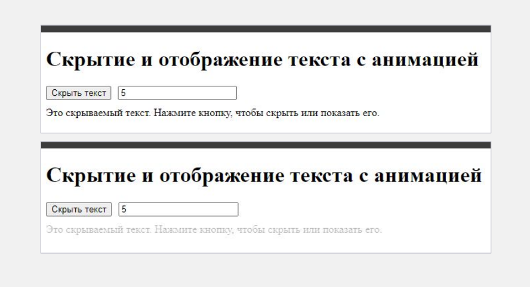

Создание приложения "Скрытие и отображение текста с анимацией и управлением длительностью анимации":
1. Создание проекта React:
● Создайте новый проект React.
● Настройте проект, подготовьте его для работы.

2. Создание компонента ToggleText:
● Создайте файл `ToggleText.js`:
○ В папке `components` вашего проекта создайте новый файл с именем `ToggleText.js`.
● Создайте файл стилей `ToggleText.css`**:
○ В папке `components` вашего проекта создайте новый файл с именем `ToggleText.css`.

3. Реализация компонента ToggleText:
● Импортируйте необходимые библиотеки:
○ В файле `ToggleText.js` импортируйте библиотеки `react` и стили из `ToggleText.css`.
● Создайте компонент ToggleText:
○ Создайте функциональный компонент `ToggleText` с помощью функции JavaScript.
○ Используйте хуки `useRef` и `useState` для управления состояниями компонента.
● Определите переменные с использованием useRef и useState:
○ Создайте переменные для хранения ссылки на элемент текста, отслеживания состояния видимости
и управления длительностью анимации.
● Создайте функцию для переключения видимости текста:
○ Определите функцию, которая будет изменять стили элемента текста для управления его
видимостью и анимацией.
● Создайте функцию для изменения длительности анимации:
○ Определите функцию, которая будет обновлять состояние длительности анимации при изменении
значения в текстовом поле.
● Возвращайте JSX из компонента:
○ Внутри компонента `ToggleText` создайте кнопку для переключения видимости текста, текстовое
поле для ввода длительности анимации и блок текста, на который будет ссылаться `useRef`.

4. Реализация стилей и анимации:
● Добавьте стили в `ToggleText.css`:
○ Определите стили для блока текста, чтобы задать максимальную высоту, скрытие переполнения и
переход для анимации.

5. Интеграция компонента ToggleText в основное приложение:
● Импортируйте компонент в `App.js`:
○ Откройте файл `App.js` в папке `src`.
○ Импортируйте компонент `ToggleText` из файла `ToggleText.js`.
● Используйте компонент ToggleText в `App.js`:
○ Внутри функции компонента `App` добавьте компонент `ToggleText`, чтобы он отображался на
странице.

6. Запуск и тестирование приложения:
● Запустите приложение
● Проверьте функциональность:
○ Убедитесь, что текст скрывается и отображается при нажатии на кнопку.
○ Измените значение в текстовом поле и проверьте, что длительность анимации изменяется
соответственно.

7. Дополнительные улучшения:
● Добавьте больше стилей:
○ Стилизуйте ваше приложение, добавив больше CSS для улучшения внешнего вида.

