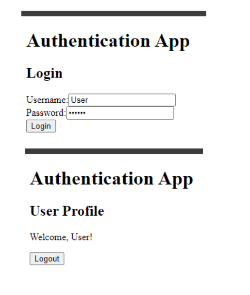

## React Практикум 14
**Задание 1: Создание приложения с аутентификацией пользователя.**

1. Создание проекта:
- Создайте новый проект React.
- Установите Redux и React-Redux.

2. Создание `store.js`:
- Импортируйте функцию `createStore` из Redux.
- Импортируйте редьюсер (будет создан позже).
- Создайте и экспортируйте store, используя `createStore` и редьюсер. Store будет хранить глобальное состояние приложения.

3. Создание `actions.js`:
- Определите типы действий (`LOGIN` и `LOGOUT`).
- Создайте и экспортируйте функции создателей действий (action creators):
    - `login`: принимает имя пользователя и возвращает действие с типом `LOGIN` и полезной нагрузкой (payload), содержащей имя пользователя.
    - `logout`: возвращает действие с типом `LOGOUT`.

4. Создание `reducers.js`:
- Определите начальное состояние (initial state), содержащее информацию о пользователе (`user`) и статус аутентификации (`isAuthenticated`).
-  Создайте и экспортируйте редьюсер, который будет обрабатывать действия `LOGIN` и `LOGOUT`:
    - `LOGIN`: обновляет состояние, устанавливая `isAuthenticated` в `true` и `user` в значение, переданное в действии.
    - `LOGOUT`: обновляет состояние, устанавливая `isAuthenticated` в `false` и `user` в `null`.

5. Создание `LoginForm.js`:
- Импортируйте необходимые модули из React и Redux.
- Создайте функциональный компонент `LoginForm`, который содержит форму для ввода имени пользователя и пароля.
- Используйте локальные состояния (`useState`) для управления вводом имени пользователя и пароля.
- Создайте обработчик отправки формы (`handleSubmit`), который вызывает действие `login` и отправляет имя пользователя в Redux store через `dispatch`.
- Подключите компонент к Redux store с помощью функции `connect`.

6. Создание `UserProfile.js`:
- Импортируйте необходимые модули из React и Redux.
- Создайте функциональный компонент `UserProfile`, который отображает информацию о пользователе и кнопку для выхода из системы.
- Создайте обработчик выхода из системы (`handleLogout`), который вызывает действие `logout` через `dispatch`.
- Подключите компонент к Redux store с помощью функции `connect`.
- Используйте `mapStateToProps` для передачи состояния из Redux store в компонент.

7. Создание `App.js`:
- Импортируйте React и компонент `connect` из `react-redux`.
- Импортируйте компоненты `LoginForm` и `UserProfile`.
- Создайте функциональный компонент `App`, который использует условный рендеринг для отображения либо компонента `LoginForm`, либо `UserProfile` в зависимости от статуса аутентификации пользователя (`isAuthenticated`).
- Подключите компонент `App` к Redux store с помощью функции `connect`.
- Используйте `mapStateToProps` для передачи состояния `isAuthenticated` из Redux store в компонент `App`.

8. Обновление `index.js`:
- Импортируйте React и ReactDOM.
- Импортируйте компонент `Provider` из `react-redux` и Redux store из `store.js`.
- Импортируйте компонент `App`.
- Оберните компонент `App` в компонент `Provider` и передайте ему Redux store через prop `store`.
- Рендерьте компонент `App` внутри элемента с идентификатором `root`.

9. Тестирование и отладка
- Запустите приложение.
- Проверьте работу приложения:
    - Убедитесь, что компонент `LoginForm` отображается по умолчанию.
    - Введите имя пользователя и пароль, чтобы войти в систему.
    - Убедитесь, что после отправки формы отображается компонент `UserProfile` с приветствием пользователя и кнопкой выхода.
    - Нажмите на кнопку выхода и убедитесь, что снова отображаетсякомпонент `LoginForm`.

10. *Дополнительные улучшения
- Добавьте валидацию формы в компоненте `LoginForm`.
- Стилизуйте компоненты для улучшения внешнего вида.
- Добавьте функционал для сохранения состояния в локальном хранилище (localStorage) для сохранения данных пользователя между сессиями.

